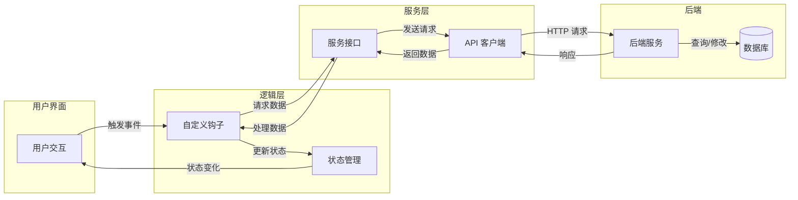

```mermaid
flowchart LR
subgraph "用户界面"
UI[用户交互]
end

subgraph "逻辑层"
Hook[自定义钩子]
Store[状态管理]
end

subgraph "服务层"
Service[服务接口]
API[API 客户端]
end

subgraph "后端"
Backend[后端服务]
DB[(数据库)]
end

UI -->|触发事件| Hook
Hook -->|更新状态| Store
Store -->|状态变化| UI
Hook -->|请求数据| Service
Service -->|发送请求| API
API -->|HTTP 请求| Backend
Backend -->|查询/修改| DB
Backend -->|响应| API
API -->|返回数据| Service
Service -->|处理数据| Hook
```
