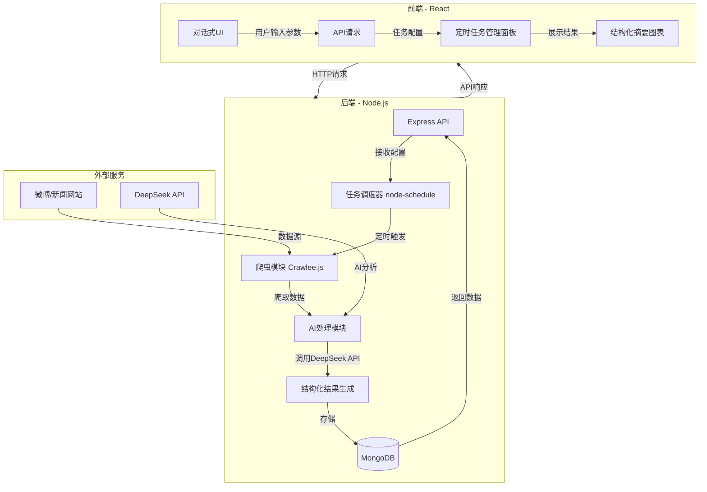
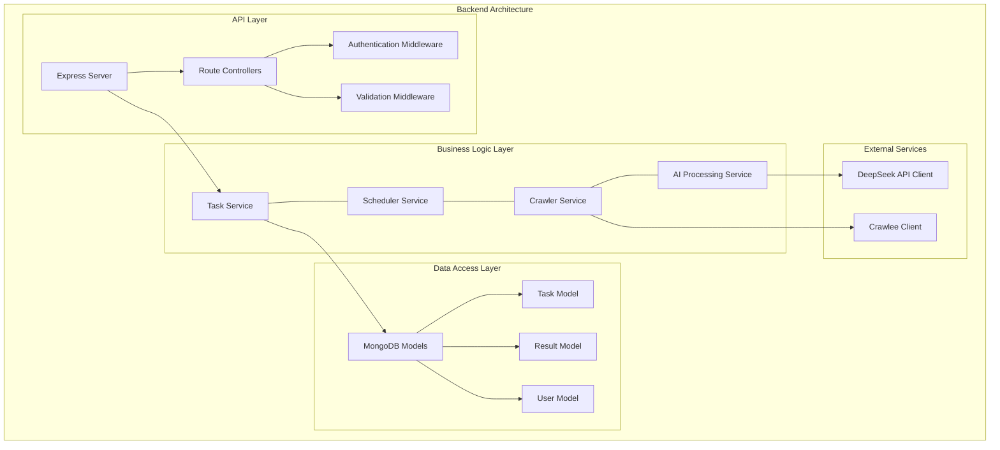
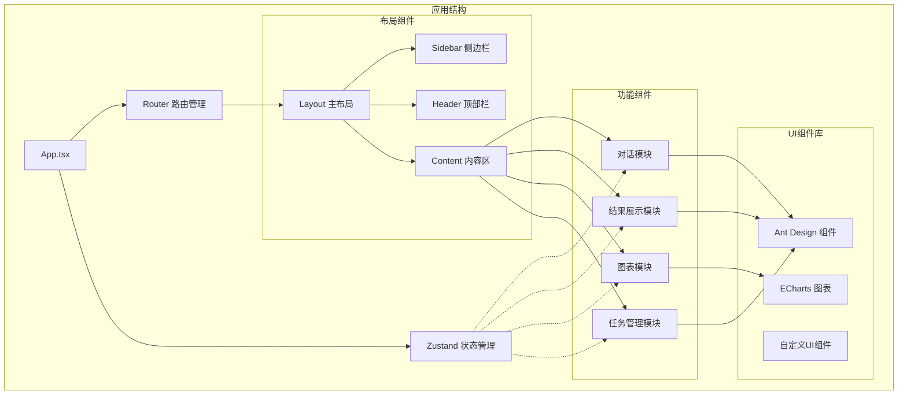
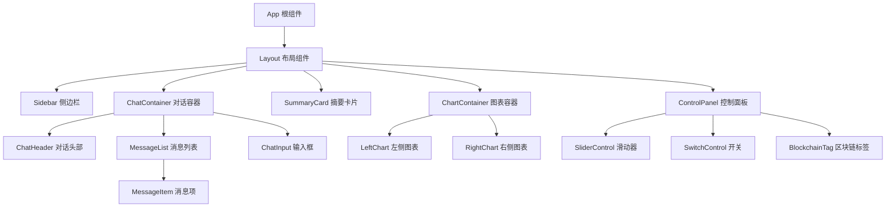
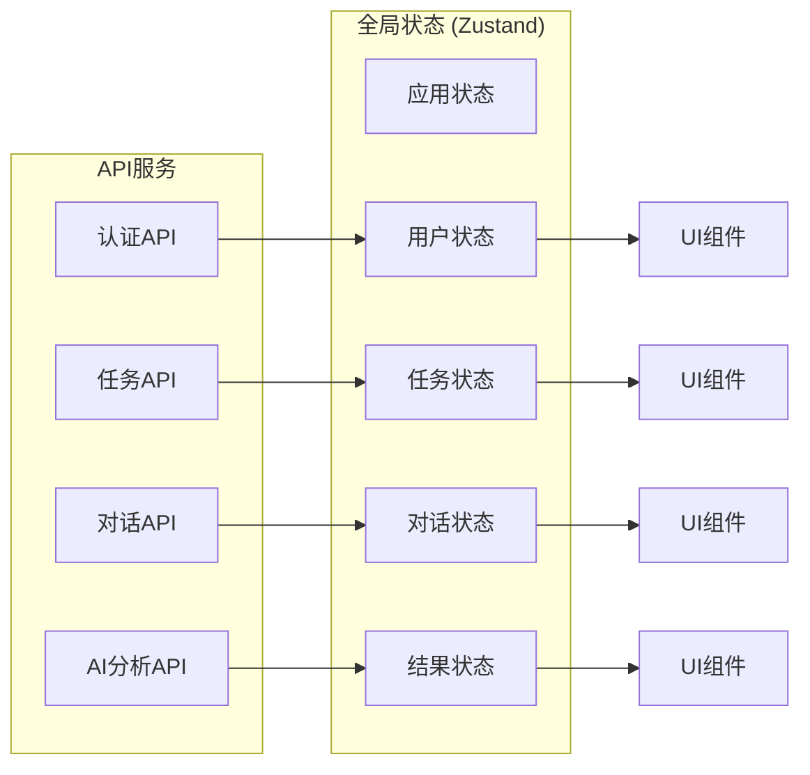
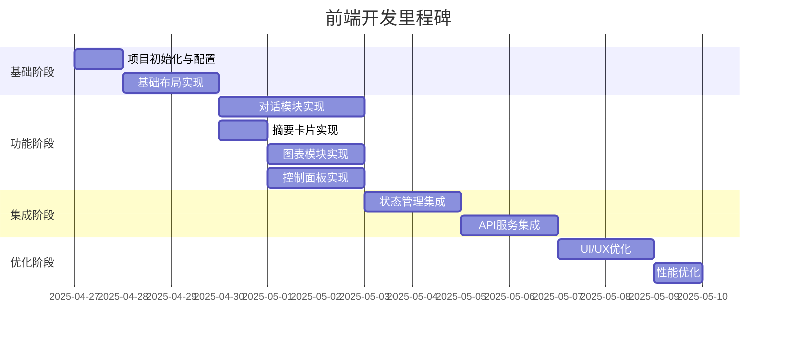

以下是结合全栈实习生笔试要求的系统设计方案，采用 **React + Node.js + MongoDB + DeepSeek API** 技术栈，并用 Mermaid 图展示核心架构：



---

### **一、模块详解**

#### **1. 前端（React）**

- **对话式交互**
  使用 `ChatUI` 组件实现自然语言交互，允许用户通过对话设置任务参数（如关键词、时间间隔）。
- **任务管理面板**
  通过 `Ant Design` 表格展示历史任务状态，支持参数实时调整：
  ```jsx
  // 参数配置表单示例
  <Form onFinish={(values) => axios.post("/api/tasks", values)}>
  	<Form.Item name="keywords" label="监控关键词">
  		<Input />
  	</Form.Item>
  	<Form.Item name="interval" label="执行间隔（分钟）">
  		<Select options={[60, 120, 360]} />
  	</Form.Item>
  </Form>
  ```

#### **2. 后端（Node.js）**

- **任务调度器**
  使用 `node-schedule` 管理定时任务，配置存储至 MongoDB：
  ```javascript
  // 创建定时任务
  const schedule = require("node-schedule");
  const job = schedule.scheduleJob("0 */1 * * *", async () => {
  	const data = await crawler.run();
  	const summary = await deepseek.analyze(data);
  	await db.saveTaskResult(summary);
  });
  ```
- **爬虫模块**
  基于 `Crawlee.js` 实现动态页面抓取，支持代理池和反爬策略：
  ```javascript
  const crawler = new PlaywrightCrawler({
  	requestHandler: async ({ page }) => {
  		const comments = await page.$$eval(".comment", (els) =>
  			els.map((el) => ({ text: el.innerText, likes: el.dataset.likes }))
  		);
  		return comments;
  	},
  });
  ```

#### **3. AI 处理模块**

- **DeepSeek API 集成**
  参数化调用模型，生成结构化摘要：
  ```javascript
  const analyze = async (text) => {
  	const response = await axios.post(
  		"https://api.deepseek.com/v1/summarize",
  		{
  			text: text,
  			params: {
  				style: "bullet_points",
  				focus_keywords: ["舆情", "热点"],
  				temperature: 0.3,
  			},
  		},
  		{ headers: { Authorization: `Bearer ${process.env.API_KEY}` } }
  	);
  	return response.data.summary;
  };
  ```

#### **4. 数据库（MongoDB）**

- **Schema 设计**
  存储任务配置与结果：
  ```javascript
  const TaskSchema = new Schema({
  	keywords: [String],
  	interval: Number,
  	lastRun: Date,
  	results: [
  		{
  			summary: String,
  			sentiment: { type: String, enum: ["positive", "neutral", "negative"] },
  		},
  	],
  });
  ```

---

### **二、部署方案**

#### **1. Docker 容器化**

```dockerfile
# 前端 Dockerfile
FROM node:18
WORKDIR /app
COPY package*.json ./
RUN npm install
COPY . .
CMD ["npm", "run", "dev"]

# 后端 Dockerfile
FROM node:18
WORKDIR /app
COPY package*.json ./
RUN npm install
COPY . .
CMD ["node", "server.js"]
```

#### **2. 环境变量配置**

```env
# .env 文件
DEEPSEEK_API_KEY=your_api_key
MONGODB_URI=mongodb://mongo:27017/tasks
```

#### **3. 一键启动**

```bash
docker-compose up -d
```

---

### **三、创新性设计**

1. **动态参数传递**
   用户可通过自然语言交互调整 AI 模型参数（如 `temperature` 控制摘要创造性）。
2. **混合任务模式**
   支持同时运行新闻汇总和社交媒体分析任务，结果交叉验证。
3. **实时监控看板**
   使用 `Echarts` 展示情感分析趋势图和关键词热度变化。

---

### **四、文档与测试**

- **GitHub 仓库结构**：
  ```
  ├── frontend/       # React 项目
  ├── backend/        # Node.js 项目
  ├── docker-compose.yml
  └── README.md       # 部署说明与API文档
  ```

通过此方案，可实现从数据采集到智能分析的完整闭环，满足笔试要求的所有技术指标。以下是结合全栈实习生笔试要求的系统设计方案，采用 **React + Node.js + MongoDB + DeepSeek API** 技术栈，并用 Mermaid 图展示核心架构：


---

### **一、模块详解**

#### **1. 前端（React）**

- **对话式交互**
  使用 `ChatUI` 组件实现自然语言交互，允许用户通过对话设置任务参数（如关键词、时间间隔）。
- **任务管理面板**
  通过 `Ant Design` 表格展示历史任务状态，支持参数实时调整：
  ```jsx
  // 参数配置表单示例
  <Form onFinish={(values) => axios.post("/api/tasks", values)}>
  	<Form.Item name="keywords" label="监控关键词">
  		<Input />
  	</Form.Item>
  	<Form.Item name="interval" label="执行间隔（分钟）">
  		<Select options={[60, 120, 360]} />
  	</Form.Item>
  </Form>
  ```

#### **2. 后端（Node.js）**

- **任务调度器**
  使用 `node-schedule` 管理定时任务，配置存储至 MongoDB：
  ```javascript
  // 创建定时任务
  const schedule = require("node-schedule");
  const job = schedule.scheduleJob("0 */1 * * *", async () => {
  	const data = await crawler.run();
  	const summary = await deepseek.analyze(data);
  	await db.saveTaskResult(summary);
  });
  ```
- **爬虫模块**
  基于 `Crawlee.js` 实现动态页面抓取，支持代理池和反爬策略：
  ```javascript
  const crawler = new PlaywrightCrawler({
  	requestHandler: async ({ page }) => {
  		const comments = await page.$$eval(".comment", (els) =>
  			els.map((el) => ({ text: el.innerText, likes: el.dataset.likes }))
  		);
  		return comments;
  	},
  });
  ```

#### **3. AI 处理模块**

- **DeepSeek API 集成**
  参数化调用模型，生成结构化摘要：
  ```javascript
  const analyze = async (text) => {
  	const response = await axios.post(
  		"https://api.deepseek.com/v1/summarize",
  		{
  			text: text,
  			params: {
  				style: "bullet_points",
  				focus_keywords: ["舆情", "热点"],
  				temperature: 0.3,
  			},
  		},
  		{ headers: { Authorization: `Bearer ${process.env.API_KEY}` } }
  	);
  	return response.data.summary;
  };
  ```

#### **4. 数据库（MongoDB）**

- **Schema 设计**
  存储任务配置与结果：
  ```javascript
  const TaskSchema = new Schema({
  	keywords: [String],
  	interval: Number,
  	lastRun: Date,
  	results: [
  		{
  			summary: String,
  			sentiment: { type: String, enum: ["positive", "neutral", "negative"] },
  		},
  	],
  });
  ```

---

### **二、部署方案**

#### **1. Docker 容器化**

```dockerfile
# 前端 Dockerfile
FROM node:18
WORKDIR /app
COPY package*.json ./
RUN npm install
COPY . .
CMD ["npm", "run", "dev"]

# 后端 Dockerfile
FROM node:18
WORKDIR /app
COPY package*.json ./
RUN npm install
COPY . .
CMD ["node", "server.js"]
```

#### **2. 环境变量配置**

```env
# .env 文件
DEEPSEEK_API_KEY=your_api_key
MONGODB_URI=mongodb://mongo:27017/tasks
```

#### **3. 一键启动**

```bash
docker-compose up -d
```

---

### **三、创新性设计**

1. **动态参数传递**
   用户可通过自然语言交互调整 AI 模型参数（如 `temperature` 控制摘要创造性）。
2. **混合任务模式**
   支持同时运行新闻汇总和社交媒体分析任务，结果交叉验证。
3. **实时监控看板**
   使用 `Echarts` 展示情感分析趋势图和关键词热度变化。

---

### **四、文档与测试**

- **GitHub 仓库结构**：
  ```
  ├── frontend/       # React 项目
  ├── backend/        # Node.js 项目
  ├── docker-compose.yml
  └── README.md       # 部署说明与API文档
  ```

通过此方案，可实现从数据采集到智能分析的完整闭环，满足笔试要求的所有技术指标。


I'll help you implement the system from the todo.md file, starting with the backend. Let's begin by creating a detailed file structure and a Mermaid design diagram to guide our implementation process. We'll follow ES6 standards throughout the implementation.

First, let's design a more detailed Mermaid diagram specifically for the backend architecture:



Now, let's create the file structure for our backend:

```
backend/
├── config/                  # Configuration files
│   ├── db.js                # Database connection
│   └── env.js               # Environment variables
├── controllers/             # Route controllers
│   ├── taskController.js    # Task management endpoints
│   └── authController.js    # Authentication endpoints
├── middlewares/             # Express middlewares
│   ├── auth.js              # Authentication middleware
│   ├── validation.js        # Input validation middleware
│   └── errorHandler.js      # Global error handler
├── models/                  # MongoDB models
│   ├── Task.js              # Task schema and model
│   ├── Result.js            # Task result schema and model
│   └── User.js              # User schema and model
├── services/                # Business logic
│   ├── taskService.js       # Task management service
│   ├── schedulerService.js  # Scheduling service using node-schedule
│   ├── crawlerService.js    # Web scraping using Crawlee
│   └── aiService.js         # DeepSeek API integration
├── utils/                   # Utility functions
│   ├── logger.js            # Logging utility
│   └── helpers.js           # Helper functions
├── routes/                  # API routes
│   ├── taskRoutes.js        # Task-related routes
│   └── authRoutes.js        # Authentication routes
├── package.json             # Dependencies and scripts
├── .env                     # Environment variables
└── server.js                # Entry point
```

This structure follows modern Node.js architecture patterns with clear separation of concerns:

1. **Controllers**: Handle HTTP requests and responses
2. **Services**: Contain business logic
3. **Models**: Define data schemas and interact with MongoDB
4. **Routes**: Define API endpoints
5. **Middlewares**: Process requests before they reach controllers
6. **Config**: Store configuration settings
7. **Utils**: House reusable utility functions

Let me know if you'd like to proceed with this structure, or if you want any adjustments before we start implementing the backend step by step.

# 智能爬虫与AI分析系统 - 前端开发方案

基于您提供的界面设计和需求，我为您准备了详细的前端开发计划。以下是组织结构设计和具体实施步骤：

## 组件架构设计图



## 组件层次结构



## 状态管理结构



## 开发实施计划

### 1. 初始化项目与基础配置

- [x] 创建 React + Vite 项目
- [ ] 配置 TypeScript、ESLint、Prettier
- [ ] 安装必要依赖 (Ant Design、ECharts、Zustand等)
- [ ] 创建项目目录结构

```bash
mkdir -p src/{components,layouts,pages,store,services,hooks,utils,styles,assets}
touch src/styles/tailwind.css
touch src/styles/variables.scss
```

### 2. 实现布局组件

- [ ] 创建主布局组件 `layouts/MainLayout.tsx`
- [ ] 实现侧边栏导航 `components/Sidebar.tsx`
- [ ] 设计暗色主题样式

### 3. 实现对话模块

- [ ] 创建对话容器 `components/chat/ChatContainer.tsx`
- [ ] 实现消息列表 `components/chat/MessageList.tsx`
- [ ] 实现消息气泡 `components/chat/MessageItem.tsx`
- [ ] 实现输入框 `components/chat/ChatInput.tsx`

### 4. 实现摘要卡片

- [ ] 创建摘要卡片组件 `components/SummaryCard.tsx`
- [ ] 实现加载状态和占位内容

### 5. 实现图表模块

- [ ] 创建图表容器 `components/charts/ChartContainer.tsx`
- [ ] 实现左侧柱状图 `components/charts/BarChartLeft.tsx`
- [ ] 实现右侧柱状图 `components/charts/BarChartRight.tsx`

### 6. 实现控制面板

- [ ] 创建控制面板容器 `components/controls/ControlPanel.tsx`
- [ ] 实现滑动控制器 `components/controls/SliderControl.tsx`
- [ ] 实现开关控制器 `components/controls/SwitchControl.tsx`
- [ ] 实现区块链标签 `components/controls/BlockchainTag.tsx`

### 7. 状态管理与API集成

- [ ] 创建Zustand状态库 `store/index.ts`
- [ ] 实现对话状态管理 `store/chatStore.ts`
- [ ] 实现结果状态管理 `store/resultStore.ts`
- [ ] 封装API请求服务 `services/api.ts`

## 优先实现的组件代码示例

### 1. 主应用组件 (App.tsx)

```tsx
// src/App.tsx
import { useState } from 'react';
import MainLayout from './layouts/MainLayout';
import './styles/global.css';

function App() {
  return (
    <div className="app dark-theme">
      <MainLayout />
    </div>
  );
}

export default App;
```

### 2. 主布局组件 (MainLayout.tsx)

```tsx
// src/layouts/MainLayout.tsx
import { Layout } from 'antd';
import Sidebar from '../components/Sidebar';
import ChatContainer from '../components/chat/ChatContainer';
import SummaryCard from '../components/SummaryCard';
import ChartContainer from '../components/charts/ChartContainer';
import ControlPanel from '../components/controls/ControlPanel';

const { Sider, Content } = Layout;

const MainLayout = () => {
  return (
    <Layout className="h-screen">
      <Sider width={70} theme="dark" className="sidebar">
        <Sidebar />
      </Sider>
      <Content className="bg-[#1a1a2e] p-4">
        <div className="flex flex-col h-full gap-4">
          <div className="flex-1">
            <ChatContainer />
          </div>
          <SummaryCard />
          <div className="flex gap-4 h-64">
            <ChartContainer />
          </div>
          <ControlPanel />
        </div>
      </Content>
    </Layout>
  );
};

export default MainLayout;
```

### 3. 对话容器组件 (ChatContainer.tsx)

```tsx
// src/components/chat/ChatContainer.tsx
import { useState } from 'react';
import ChatHeader from './ChatHeader';
import MessageList from './MessageList';
import ChatInput from './ChatInput';
import { Message } from '../../types';

const ChatContainer = () => {
  const [messages, setMessages] = useState<Message[]>([
    {
      id: '1',
      type: 'ai',
      content: '您好！我可以协助您分析数据，生成报告，甚至进行预测分析。',
      timestamp: new Date()
    }
  ]);

  const handleSendMessage = (content: string) => {
    // 添加用户消息
    const userMessage: Message = {
      id: Date.now().toString(),
      type: 'user',
      content,
      timestamp: new Date()
    };
    setMessages([...messages, userMessage]);

    // 模拟AI响应
    setTimeout(() => {
      const aiMessage: Message = {
        id: (Date.now() + 1).toString(),
        type: 'ai',
        content: '我正在处理您的请求...',
        timestamp: new Date()
      };
      setMessages(prev => [...prev, aiMessage]);
    }, 1000);
  };

  return (
    <div className="flex flex-col h-full bg-[#242438] rounded-lg overflow-hidden">
      <ChatHeader />
      <MessageList messages={messages} />
      <ChatInput onSend={handleSendMessage} />
    </div>
  );
};

export default ChatContainer;
```

## 开发里程碑计划



## 后续开发建议

1. **渐进实现** - 先搭建主体框架，再丰富细节
2. **组件驱动开发** - 每个组件独立开发测试
3. **状态与UI分离** - 使用Zustand管理全局状态
4. **响应式设计** - 兼顾不同设备尺寸

通过以上计划，您可以系统性地构建出所需的AI交互平台前端界面。每个组件都有明确的职责和定义，确保整体架构的可维护性和可扩展性。

## 下一步建议

1. 设置项目基础配置文件
2. 完成布局组件的实现
3. 实现核心对话模块

您希望从哪一部分开始实现？