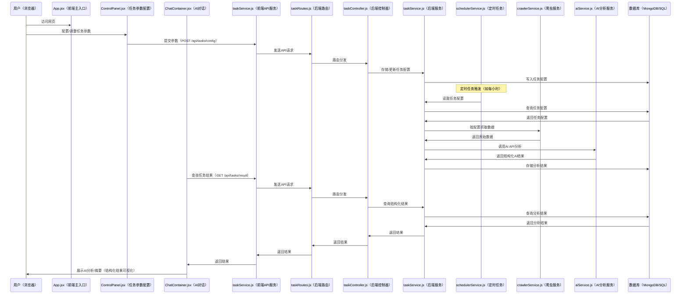

```mermaid
sequenceDiagram
    participant User as 用户（浏览器）
    participant FE_App as App.jsx（前端主入口）
    participant FE_Control as ControlPanel.jsx（任务参数配置）
    participant FE_Chat as ChatContainer.jsx（AI对话）
    participant FE_API as taskService.js（前端API服务）
    participant BE_Route as taskRoutes.js（后端路由）
    participant BE_Controller as taskController.js（后端控制器）
    participant BE_Service as taskService.js（后端服务）
    participant BE_Scheduler as schedulerService.js（定时任务）
    participant BE_Crawler as crawlerService.js（爬虫服务）
    participant BE_AI as aiService.js（AI分析服务）
    participant DB as 数据库（MongoDB/SQL）

    User->>FE_App: 访问网页
    User->>FE_Control: 配置/调整任务参数
    FE_Control->>FE_API: 提交参数（POST /api/tasks/config）
    FE_API->>BE_Route: 发送API请求
    BE_Route->>BE_Controller: 路由分发
    BE_Controller->>BE_Service: 存储/更新任务配置
    BE_Service->>DB: 写入任务配置

    Note over BE_Scheduler: 定时任务触发（如每小时）
    BE_Scheduler->>BE_Service: 读取任务配置
    BE_Service->>DB: 查询任务配置
    DB->>BE_Service: 返回任务配置
    BE_Service->>BE_Crawler: 按配置抓取数据
    BE_Crawler->>BE_Service: 返回原始数据
    BE_Service->>BE_AI: 调用AI API分析
    BE_AI->>BE_Service: 返回结构化AI结果
    BE_Service->>DB: 存储分析结果

    FE_Chat->>FE_API: 查询任务结果（GET /api/tasks/result）
    FE_API->>BE_Route: 发送API请求
    BE_Route->>BE_Controller: 路由分发
    BE_Controller->>BE_Service: 查询结构化结果
    BE_Service->>DB: 查询分析结果
    DB->>BE_Service: 返回分析结果
    BE_Service->>BE_Controller: 返回结果
    BE_Controller->>BE_Route: 返回结果
    BE_Route->>FE_API: 返回结果
    FE_API->>FE_Chat: 返回结果
    FE_Chat->>User: 展示AI分析/摘要（结构化结果可视化）
```
