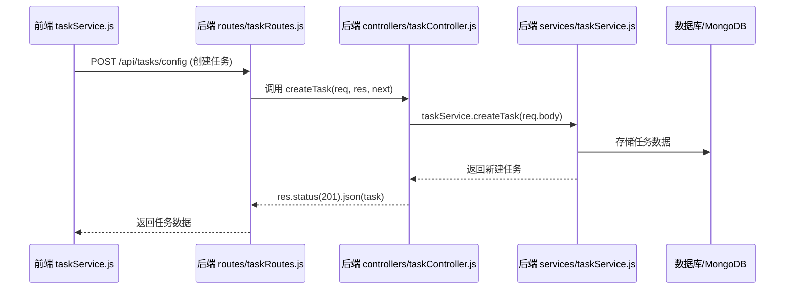

状态提升到父组件作为状态state统一管理

状态流转:通过props传递给子组件保证数据的单向流动和同步

必要时用useContext优化多层级传递

需要共享的数据应该在父组件中用useState管理，子组件通过props传递

子组件使用setter函数修改状态

这个时序图展示了数据从前端（taskService.js）发起请求，到后端路由（taskRoutes.js）、控制器（taskController.js）、服务层（taskService.js）、数据库，再流回前端的完整流程。

