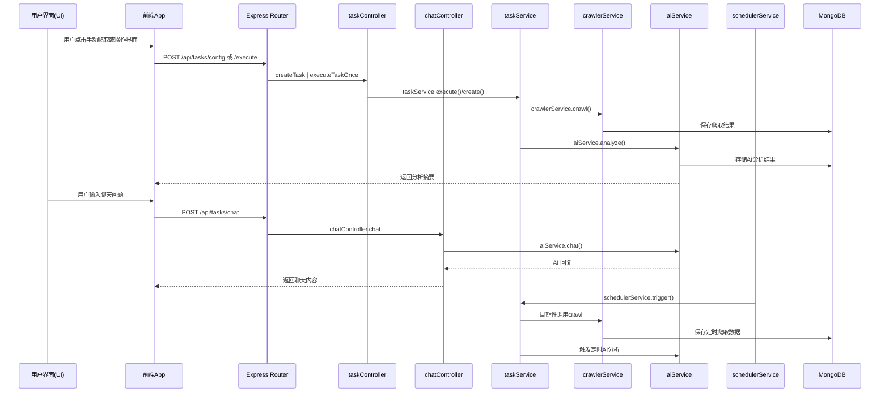

## 我有点懒得写了

```mermaid
sequenceDiagram
    participant UI as 用户界面(UI)
    participant FE as 前端App
    participant Router as Express Router
    participant TC as taskController
    participant CC as chatController
    participant TS as taskService
    participant CS as crawlerService
    participant AS as aiService
    participant SS as schedulerService
    participant DB as MongoDB

    %% 用户触发任务流程
    UI->>FE: 用户点击手动爬取或操作界面
    FE->>Router: POST /api/tasks/config 或 /execute
    Router->>TC: createTask | executeTaskOnce
    TC->>TS: taskService.execute()/create()
    TS->>CS: crawlerService.crawl()
    CS->>DB: 保存爬取结果
    TS->>AS: aiService.analyze()
    AS->>DB: 存储AI分析结果
    AS-->>FE: 返回分析摘要

    %% AI 聊天流程
    UI->>FE: 用户输入聊天问题
    FE->>Router: POST /api/tasks/chat
    Router->>CC: chatController.chat
    CC->>AS: aiService.chat()
    AS-->>CC: AI 回复
    CC-->>FE: 返回聊天内容

    %% 定时调度流程
    SS->>TS: schedulerService.trigger()
    TS->>CS: 周期性调用crawl
    CS->>DB: 保存定时爬取数据
    TS->>AS: 触发定时AI分析
```
