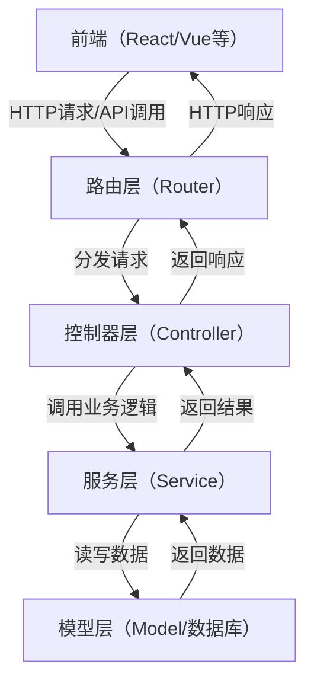

好的，以下是结合你项目、以中等规模公司面试官视角可能会问到的 React 前端面试问题：

1. **组件设计与状态管理**
   - 你在 MainLayout 组件中是如何管理不同子组件之间的状态同步的？比如 taskConfig、selectedTaskId 的流转是如何实现的？
     这个问题考察你对 React 组件状态提升、props 传递和数据流的理解。

**参考答案与分析思路：**

在 MainLayout 组件中，通常会将需要被多个子组件共享的状态（如 taskConfig、selectedTaskId）提升到 MainLayout 作为 state 进行统一管理。MainLayout 通过 props 将这些状态和对应的 setState 方法传递给子组件。这样，子组件在需要读取或修改这些状态时，都通过 props 进行，保证了数据的单向流动和同步

例如：

- MainLayout 维护 taskConfig、selectedTaskId 的 useState。
- 将 taskConfig、setTaskConfig、selectedTaskId、setSelectedTaskId 作为 props 传递给 ControlPanel、HistoryPanel、SummaryCard 等子组件。
- 当子组件需要更新这些状态时，调用 props 传递下来的 set 方法，MainLayout 负责更新并同步到所有相关子组件。

这种方式保证了状态的集中管理和一致性，避免了多处维护同一份数据导致的不同步问题。如果状态更复杂或层级更深，也可以考虑使用 React Context 或全局状态管理库（如 Redux）。

**分析思路：**

- 状态提升到最近的公共父组件
- 通过 props 单向传递数据和回调
- 保证数据流动清晰、易于维护
- 必要时可用 context 优化跨层级传递

---

- 如果多个组件需要共享同一份数据，你会选择什么样的状态管理方式？在你的项目中有没有遇到类似场景？

- 如果多个组件需要共享同一份数据，你会选择什么样的状态管理方式？在你的项目中有没有遇到类似场景？ 这个问题要如何回答?结合刚才的理解,我的回答可能是:我会创建一个父组件用 usestate 统一创建这些组件要用到的同一份数据以及此份数据的 setter,在此父组件中统一管理多个需要共享同一份数据的组件.我的回答怎么样?

你的回答是正确的，体现了 React 状态提升的核心思想。可以稍作补充，让表达更完整、更专业：

---

**参考回答：**

如果多个组件需要共享同一份数据，我会将这份数据的 state 和对应的 setter 提升到它们最近的共同父组件中（比如 MainLayout），用 useState 统一管理。然后通过 props，把数据和 setter 传递给需要的子组件。这样，所有子组件都能访问和修改同一份数据，保证了数据的一致性和同步。

在我的项目中，比如 taskConfig、selectedTaskId 就是这样管理的。MainLayout 作为父组件，统一用 useState 管理这些状态，并通过 props 传递给 ControlPanel、HistoryPanel、SummaryCard 等子组件，实现了多个组件间的数据共享和同步。

如果状态更复杂或组件层级更深，也可以考虑用 React Context 或 Redux 这类全局状态管理方案。

---

这样回答既体现了你的理解，也结合了实际项目经验，面试官会觉得你思路清晰、实践到位。

---

2. **性能优化**

   - 当 HistoryPanel 组件刷新时，如何避免不必要的子组件重渲染？你在项目中有做过哪些性能优化？
     **参考答案与分析思路：**

当 HistoryPanel 组件刷新时，为了避免不必要的子组件重渲染，可以采取以下优化措施：

- **合理拆分组件**：将页面拆分为更小的、职责单一的组件，只有需要刷新的组件才会重新渲染，其他组件不会受影响。
- **使用 React.memo**：对于纯展示型组件，可以用 React.memo 包裹，只有 props 变化时才会重新渲染，避免父组件刷新导致的无关子组件重渲染。
- **优化 props 传递**：确保传递给子组件的 props 没有不必要的变化，比如避免每次 render 都生成新的函数或对象。
- **useCallback/useMemo**：对于需要传递给子组件的函数或复杂对象，可以用 useCallback 或 useMemo 缓存，减少因引用变化导致的重渲染。

在我的项目中，HistoryPanel 的刷新是通过 refreshKey 控制的，只有 refreshKey 变化时才会重新拉取数据。其他子组件如 ChatContainer、SummaryCard 等不会因为 HistoryPanel 的刷新而重渲染，这样保证了性能。

**思路总结：**

- 组件拆分，减少渲染影响范围
- React.memo、useCallback、useMemo 等优化重渲染
- 只让需要刷新的组件响应状态变化
- 避免 props 不必要的变化

## 这些措施可以有效提升 React 应用的性能和响应速度。

- 如果页面数据量很大（如历史任务很多），你会如何优化渲染和交互体验？

你的回答方向是对的，面试官会觉得你有优化意识。可以这样补充和完善：

---

**参考答案：**

如果页面数据量很大，比如历史任务非常多，我会从渲染和交互两个方面进行优化：

1. **渲染优化：虚拟列表/懒加载**
   我会采用虚拟列表（如 react-window、react-virtualized 等库）或懒加载技术。原理是只渲染当前视口（用户可见区域）内的那部分数据，其他数据不渲染或延后渲染。这样即使有上千条数据，页面也不会卡顿，滚动时再动态加载和渲染新出现的数据项。

2. **交互优化：可视化时间轴或分页**
   可以用时间轴、分页、分组等方式优化用户查找和浏览体验，避免一次性展示所有数据。

3. **数据层优化**
   后端接口可以支持分页或按需加载，前端只请求当前需要的数据，减少网络和内存压力。

---

**懒加载/虚拟列表原理简述：**

- 虚拟列表会根据滚动条的位置，只把可见区域的那几十条数据渲染到 DOM 中，其他数据项只是占位，不会实际渲染。
- 当用户滚动时，组件会动态计算哪些数据需要渲染，哪些可以移除或延后渲染，从而大幅减少 DOM 节点数量和渲染压力。

---

**总结：**
你可以说：“我会用虚拟列表或懒加载技术，只渲染视口内的数据项，提升性能；同时用时间轴、分页等方式优化交互体验。这样即使数据量很大，页面依然流畅。”

---

3. **组件通信**

   - 你的项目中父子组件是如何通信的？有没有用到 context 或其他跨层级通信方式？
     **参考答案与分析思路：**

在我的项目中，父子组件之间主要通过 props 进行通信。父组件（如 MainLayout）将需要的数据和回调函数通过 props 传递给子组件，子组件通过 props 读取数据或调用回调通知父组件进行状态更新。这是 React 推荐的数据流方式，保证了数据的单向流动和组件间的解耦。

例如，MainLayout 统一管理 taskConfig、selectedTaskId 等状态，并将它们和对应的 set 方法作为 props 传递给 ControlPanel、HistoryPanel、SummaryCard 等子组件。这样，子组件既能获取当前状态，也能通过回调修改状态，实现了父子间的高效通信。

目前我的项目还没有用到 React Context 或其他跨层级通信方式，因为现有的组件层级和数据流通过 props 就能很好地满足需求。如果将来组件层级更深或有更多全局状态需要共享，可以考虑引入 Context 或 Redux 等全局状态管理方案。

**思路总结：**

- 父子通信首选 props，保证单向数据流
- 需要时通过回调 props 让子组件影响父组件状态
- 跨层级或全局共享状态时可用 Context/Redux
- 选择最简单、最适合当前项目规模的方案

  - 如果需要在不相关的两个组件之间传递消息，你会怎么做？
    你的回答是对的，体现了 React 单向数据流和状态提升的思想。可以补充得更完整一些，让表达更专业：

---

**参考答案：**

如果需要在不相关的两个组件之间传递消息，我会把它们需要共享的状态提升到它们最近的共同父组件（比如 MainLayout）中，由父组件用 useState 统一管理。这样，一个子组件可以通过 props 传递下来的 setter 修改状态，父组件更新后会把新的状态通过 props 传递给另一个子组件，实现了组件间的通信和联动。

这种方式利用了 React 的单向数据流和状态提升，保证了数据同步和组件解耦。如果组件层级很深或者有更多全局状态需要共享，也可以考虑用 React Context 或 Redux 等全局状态管理方案。

---

这样回答既体现了你的理解，也展示了你对 React 设计理念的把握。

---

4. **副作用与生命周期**

   - 你在项目中如何处理副作用（如定时拉取历史记录）？useEffect 的依赖项如何设置？
   - 如果需要在组件卸载时清理定时器，你会怎么做？

- 你在项目中如何处理副作用（如定时拉取历史记录）？useEffect 的依赖项如何设置？对于这个问题的答案,我的回答是:我使用 useEffect 处理副作用及其依赖,依赖项在 useEffect 的第二个参数中的数组内设置.如果需要在组件卸载时清理定时器,我会设置清理函数.我的回答如何?

  你的回答是对的，已经抓住了核心点。可以稍微补充细节，让表达更完整、更专业：

---

**参考答案：**

我在项目中使用 `useEffect` 处理副作用，比如定时拉取历史记录或倒计时。依赖项通过 `useEffect` 的第二个参数（依赖数组）来设置，只有依赖项变化时副作用才会重新执行。
如果副作用中有定时器或订阅等需要清理的资源，我会在 `useEffect` 返回一个清理函数（return 一个函数），这样在组件卸载或依赖变化时，React 会自动调用这个清理函数，防止内存泄漏或重复执行。

例如：

```jsx
useEffect(() => {
	const timer = setInterval(() => {
		/* ... */
	}, 1000);
	return () => clearInterval(timer);
}, [依赖项]);
```

这样可以确保副作用的正确管理和资源释放。

---

5. **可维护性与可扩展性**

   - 你的组件是如何拆分的？你如何保证项目结构的可维护性？
   - 如果要新增一个“设置”功能，你会如何在现有结构下扩展？

**参考答案与思路：**

---

**1. 你的组件是如何拆分的？你如何保证项目结构的可维护性？**

我的组件拆分遵循“单一职责原则”，即每个组件只负责一块独立的功能。例如，MainLayout 负责整体布局，ControlPanel 负责参数配置，HistoryPanel 负责历史记录展示，ChatContainer 负责聊天交互，SummaryCard 负责摘要展示等。这样每个组件都足够小且职责清晰，便于维护和复用。

项目结构上，我会将组件、API、样式等按功能模块分别放在不同的文件夹下，保持目录清晰。对于通用组件或工具函数，会单独抽离，避免重复代码。这样做可以让项目易于扩展和协作，也方便后期定位和修改问题。

---

**2. 如果要新增一个“设置”功能，你会如何在现有结构下扩展？**

如果要新增“设置”功能，我会先在 MainLayout 中为“设置”区域预留一个 section（比如已有的 `<section id="section-settings">`），然后新建一个 SettingPanel 组件，专门负责设置相关的 UI 和逻辑。
我会将设置相关的状态提升到 MainLayout 统一管理，并通过 props 传递给 SettingPanel。这样既不会影响现有功能，也方便后续维护和扩展。

如果设置项需要被多个组件使用，可以考虑用 React Context 或全局状态管理（如 Redux）来共享设置数据，保证全局一致性。

---

**思路总结：**

- 组件拆分要小而专一，结构清晰
- 项目目录按功能模块化，通用部分抽离
- 新功能通过新增组件和提升状态扩展，不影响现有结构
- 必要时用 Context/Redux 管理全局配置

这样可以保证项目的可维护性和可扩展性。

6. **错误处理与用户体验**

   - 当后端 API 请求失败时，你的前端是如何处理的？如何向用户反馈？
   - 你如何保证表单输入的健壮性和用户体验？

**参考答案与思路：**

---

**1. 当后端 API 请求失败时，你的前端是如何处理的？如何向用户反馈？**

在我的项目中，所有 API 请求都用 try-catch 或 promise 的 catch 方法进行错误捕获。如果请求失败，会在控制台输出错误信息，并通过设置状态（如 error state）在界面上给用户友好的提示，比如弹出消息、显示错误提示条等，避免用户无感知地等待或误操作。这样可以提升用户体验，让用户及时了解问题。

**思路总结：**

- 用 try-catch 或 catch 捕获 API 错误
- 记录错误日志，便于排查
- 通过 UI（如弹窗、提示条、红字等）及时反馈给用户
- 可引导用户重试或联系管理员

---

**2. 你如何保证表单输入的健壮性和用户体验？**

我会在表单输入时做前端校验，比如必填项、格式校验、长度限制等，防止无效数据提交。校验不通过时，实时给出清晰的错误提示，帮助用户快速修正。同时，表单提交时会禁用按钮或显示 loading 状态，避免重复提交。这样既保证了数据的有效性，也提升了用户体验。

**思路总结：**

- 前端实时校验（必填、格式、长度等）
- 校验不通过时及时提示
- 提交时禁用按钮或显示 loading，防止重复提交
- 校验通过后再提交到后端，保证数据健壮性

---

这样可以有效提升系统的健壮性和用户体验。

7. **前后端接口对接**

   - 你是如何设计和调用后端 API 的？接口变更时前端如何适配？
   - 你在调用接口时如何处理异步和 loading 状态？

**参考答案与思路：**

---

**1. 你是如何设计和调用后端 API 的？接口变更时前端如何适配？**

在我的项目中，后端 API 遵循 RESTful 风格，接口路径清晰、语义明确（如 `/api/tasks/config`、`/api/tasks/:id/start` 等）。前端通过封装的 API 服务模块（如 `taskService.js`）统一管理所有接口的调用，这样可以集中处理请求、响应和错误，便于维护和复用。

当接口变更时，我只需要在 API 服务层（如 `taskService.js`）集中修改对应的请求方法，不需要在各个组件里逐一修改，保证了前端代码的可维护性和适应性。同时，我会和后端保持良好的沟通，及时同步接口文档和变更，确保前后端协作顺畅。

**思路总结：**

- 后端接口 RESTful，路径清晰
- 前端统一封装 API 调用，便于维护
- 接口变更时只需修改 API 服务层
- 保持与后端的沟通，及时同步文档

---

**2. 你在调用接口时如何处理异步和 loading 状态？**

每次调用异步 API 时，我会在组件中设置 loading 状态（如 `isLoading`），在请求开始时设为 `true`，请求结束后设为 `false`。这样可以在界面上显示加载动画或禁用按钮，提升用户体验，防止重复提交。

同时，所有异步请求都用 try-catch 或 promise 的 catch 方法处理异常，保证即使请求失败也能给用户友好提示，不会导致页面卡死或无响应。

**思路总结：**

- 调用接口时设置 loading 状态，提升用户体验
- 请求前后切换 loading，控制按钮和动画
- 用 try-catch/catch 处理异常，防止页面崩溃
- 失败时给用户友好提示

---

这样可以保证前后端接口对接的健壮性和良好的用户体验。

8. **样式与布局**

   - 你的项目是如何组织和复用 CSS 的？有没有用到 CSS Modules、styled-components 或其他方案？
   - 如何实现响应式布局？

9. **安全性**

   - 前端如何防止 XSS、CSRF 等安全问题？在你的项目中有哪些安全措施？

10. **测试与调试**
    - 你在开发过程中如何进行前端调试？有没有写过单元测试或集成测试？

这些问题既考察了你对 React 基础的理解，也结合了你项目的实际情况。


前后端的交互流程通常是这样的：
前端发起请求 → 路由分发 → 控制器处理 → 服务层执行业务 → 模型层操作数据库 → 返回结果给前端

